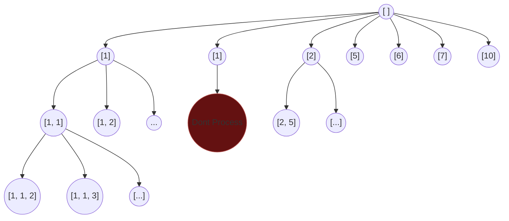

```mermaid
graph TD
    %% Node Definitions
    Root(("[ ]"))
    C1(("[1]"))
    C2(("[1]"))
    C3(("[2]"))
    C4(("[5]"))
    C5(("[6]"))
    C6(("[7]"))
    C7(("[10]"))
    
    C1_1(("[1, 1]"))
    C1_2(("[1, 2]"))
    C1_3(("[1, 5]"))
    C1_3(("..."))
    
    C2_1(("Dont Process")):::redNode
    
    C3_1(("[2, 5]"))
    C3_2(("[...]"))
    
    C1_1_1(("[1, 1, 2]"))
    C1_1_2(("[1, 1, 3]"))
    C1_1_3(("[...]"))
    
    %% Connections
    Root --> C1
    Root --> C2
    Root --> C3
    Root --> C4
    Root --> C5
    Root --> C6
    Root --> C7
    
    C1 --> C1_1
    C1 --> C1_2
    C1 --> C1_3
    
    C2 --> C2_1
    
    C3 --> C3_1
    C3 --> C3_2
    
    C1_1 --> C1_1_1
    C1_1 --> C1_1_2
    C1_1 --> C1_1_3
    
    %% Styling
    classDef blueNode fill:#d1e1ff,stroke:#84a9ff;
    classDef redNode fill:#641111,stroke:#b85450;
    classDef greenNode fill:#116400,color:#fff;
```