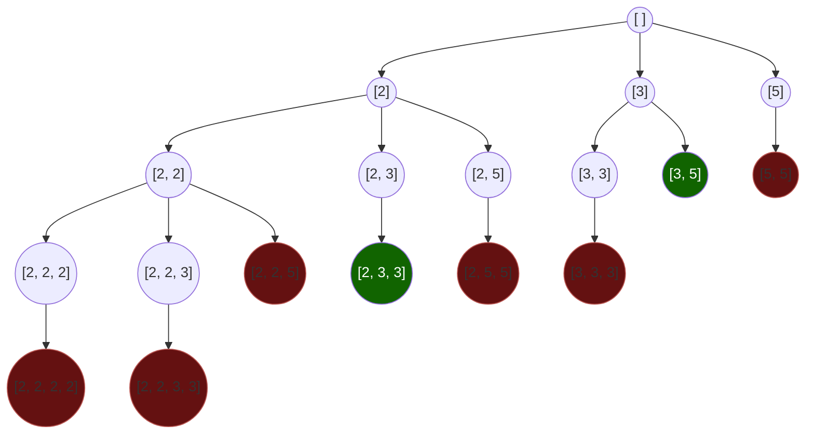

```mermaid
graph TD
    %% Node Definitions
    Root(("[ ]"))
    C1(("[2]"))
    C2(("[3]"))
    C3(("[5]"))
    
    C1_1(("[2, 2]"))
    C1_2(("[2, 3]"))
    C1_3(("[2, 5]"))
    
    C2_1(("[3, 3]"))
    C2_2(("[3, 5]")):::greenNode
    
    C3_1(("[5, 5]")):::redNode
    
    C1_1_1(("[2, 2, 2]"))
    C1_1_2(("[2, 2, 3]"))
    C1_1_3(("[2, 2, 5]")):::redNode
    
    C1_2_2(("[2, 3, 3]")):::greenNode
    
    C1_1_1_1(("[2, 2, 2, 2]")):::redNode
	
		C1_1_2_1(("[2, 2, 3, 3]")):::redNode

		C2_1_1(("[3, 3, 3]")):::redNode
	
		C1_3_1(("[2, 5, 5]")):::redNode
		
    %% Connections
    Root --> C1
    Root --> C2
    Root --> C3
    
    C1 --> C1_1
    C1 --> C1_2
    C1 --> C1_3
    
    C2 --> C2_1
    C2 --> C2_2
    
    C3 --> C3_1
    
    C1_1 --> C1_1_1
    C1_1 --> C1_1_2
    C1_1 --> C1_1_3

		C1_2 --> C1_2_2
		
		C1_1_1 --> C1_1_1_1
		C1_1_2 --> C1_1_2_1
		
		C2_1 --> C2_1_1
		C1_3 --> C1_3_1
    %% Styling
    classDef blueNode fill:#d1e1ff,stroke:#84a9ff;
    classDef redNode fill:#641111,stroke:#b85450;
    classDef greenNode fill:#116400,color:#fff;
```